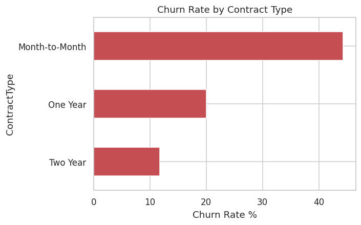
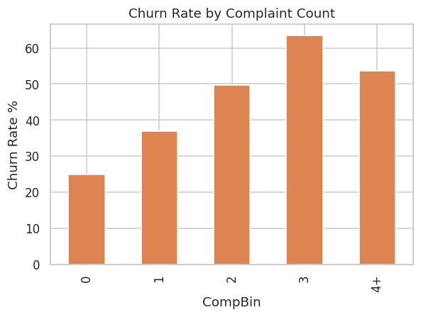

# 📉 Customer Churn Analysis using Python & Machine Learning


An end-to-end, enterprise-style churn prediction project: a realistic 7,500-customer telecom dataset, full CRISP-DM workflow, 8 compared ML models, SHAP explainability, and 31 business insights tied to real computed numbers — built for a Data Analyst / Data Scientist portfolio.

---

## 📌 Business Problem

The business is losing **31.7% of its customers** — worth **$205,091/month** in recurring revenue and **$8.79M** in cumulative customer lifetime value. Leadership needs to know *who* is at risk, *why*, and *what to do about it*.

## 🎯 Objectives

- Identify the strongest, most actionable churn drivers
- Build a model that reliably ranks customers by churn risk
- Translate every technical finding into a specific, prioritized business recommendation

## 📈 Expected Business Impact

Even a modest reduction in month-to-month churn (the single biggest driver, 44.3% vs. 11.7% for two-year contracts) would recover a meaningful share of the $205K/month currently at risk — see `reports/Executive_Summary.md` for the full business case.

---

## 🗂️ Dataset

A **fully synthetic, 7,500-row** telecom/subscription customer dataset (`dataset/customer_churn.csv`), generated with deliberately engineered business patterns rather than random noise — see `src/generate_dataset.py` for the exact generative logic:

- Month-to-month contracts churn far more than annual contracts
- High monthly charges + low tenure raise churn risk
- Frequent complaints/support tickets raise churn risk
- Electronic check payers churn more than autopay users
- Protective add-ons (tech support, online security) reduce churn
- Long-tenure, high-CLV customers are stickier

| Column | Description |
|---|---|
| CustomerID | Unique customer identifier |
| Gender, Age, SeniorCitizen, MaritalStatus, Dependents | Demographics |
| Tenure | Months as a customer |
| ContractType | Month-to-Month / One Year / Two Year |
| InternetService, PhoneService | Core services subscribed |
| StreamingTV, StreamingMovies, OnlineSecurity, OnlineBackup, DeviceProtection, TechSupport | Add-on services |
| MonthlyCharges, TotalCharges | Billing |
| PaymentMethod, PaperlessBilling | Payment behavior |
| NumberOfComplaints, SupportTickets, CustomerSatisfactionScore | Service experience |
| LastInteractionDate | Most recent contact |
| ReferralStatus | Came via referral (Yes/No) |
| CustomerLifetimeValue | Estimated lifetime value |
| **Churn** | **Target variable (Yes/No)** |

The raw dataset also includes a small, realistic amount of injected messiness (missing `TotalCharges`, inconsistent `Gender` casing, duplicate rows) that the cleaning pipeline documents and fixes.

---

## 🛠️ Technology Stack

Python 3.11+ · Pandas · NumPy · Matplotlib · Seaborn · scikit-learn · XGBoost · SHAP · Joblib · Jupyter Notebook

---

## 🧭 Machine Learning Pipeline

```
Raw Data → Cleaning → Feature Engineering → Model Training (8 algorithms)
   → Model Selection (ROC-AUC) → Evaluation & SHAP → Business Insights
```

**8 models compared** (Logistic Regression, Decision Tree, Random Forest, Gradient Boosting, XGBoost, SVM, KNN, Naive Bayes) via stratified 5-fold cross-validation.

**Winner: Logistic Regression — Test ROC-AUC 0.7835**, narrowly ahead of Gradient Boosting (0.7801), indicating the churn signal here is largely additive rather than deeply non-linear — and the winning model is also the most explainable one.

---

## 📁 Project Structure

```
Customer-Churn-Analysis/
├── README.md
├── requirements.txt
├── LICENSE
├── .gitignore
├── dataset/
│   ├── customer_churn.csv              # raw (7,525 rows incl. injected dupes/missing)
│   ├── customer_churn_clean.csv        # cleaned (7,500 rows)
│   └── customer_churn_features.csv     # cleaned + engineered features
├── notebooks/
│   ├── 01_data_understanding.ipynb
│   ├── 02_data_cleaning.ipynb
│   ├── 03_exploratory_data_analysis.ipynb   # 26 business-question-driven analyses
│   ├── 04_feature_engineering.ipynb
│   ├── 05_model_building.ipynb
│   ├── 06_model_evaluation.ipynb            # incl. SHAP explainability
│   └── 07_business_insights.ipynb
├── src/
│   ├── config.py
│   ├── data_loader.py
│   ├── data_cleaning.py
│   ├── feature_engineering.py
│   ├── train_model.py
│   ├── predict.py
│   ├── evaluation.py
│   ├── visualization.py
│   ├── utils.py
│   └── generate_dataset.py
├── models/
│   ├── trained_model.pkl
│   ├── feature_scaler.pkl
│   ├── label_encoders.pkl
│   ├── model_metadata.pkl
│   ├── model_comparison.csv
│   └── feature_importance.csv
├── reports/
│   ├── Executive_Summary.md
│   ├── Business_Questions.md
│   ├── Business_Insights.md
│   ├── Model_Evaluation.md
│   ├── Feature_Importance.md
│   ├── Interview_QA.md
│   └── Business_Report.pdf
└── images/
    ├── plots/               # confusion matrix, ROC curve, feature importance, correlation heatmap, SHAP summary
    └── eda_charts/          # standalone EDA chart exports
```

---

## ⚙️ Installation & How to Run

```bash
git clone https://github.com/<your-username>/Customer-Churn-Analysis.git
cd Customer-Churn-Analysis
pip install -r requirements.txt

# Regenerate the dataset (optional — already included)
python src/generate_dataset.py

# Run the full pipeline
cd src
python -c "
from data_loader import load_csv, save_csv
from data_cleaning import clean_pipeline
from feature_engineering import engineer_features
import config
df = load_csv(config.RAW_DATA_PATH)
clean = clean_pipeline(df)
save_csv(clean, config.CLEAN_DATA_PATH)
feat = engineer_features(clean)
save_csv(feat, config.FEATURED_DATA_PATH)
"
python train_model.py
python predict.py

# Or explore step by step in Jupyter
jupyter notebook ../notebooks/
```

---

## 📊 Model Performance

| Model | Test ROC-AUC | CV ROC-AUC |
|---|---|---|
| **Logistic Regression** | **0.7835** | 0.7880 ± 0.0118 |
| Gradient Boosting | 0.7801 | 0.7840 ± 0.0105 |
| Random Forest | 0.7707 | 0.7771 ± 0.0115 |
| XGBoost | 0.7698 | 0.7661 ± 0.0093 |
| Naive Bayes | 0.7641 | 0.7700 ± 0.0087 |
| SVM | 0.7550 | 0.7480 ± 0.0057 |
| Decision Tree | 0.7522 | 0.7494 ± 0.0104 |
| K-Nearest Neighbors | 0.7384 | 0.7404 ± 0.0066 |

Accuracy **74.5%** · Precision **63.4%** · Recall **46.2%** · F1 **53.5%** (full breakdown + threshold tuning guidance in `reports/Model_Evaluation.md`)


---

## 💡 Business Insights (Selected)

- **Contract type is the #1 driver:** Month-to-Month churns at 44.3% vs. 11.7% for Two Year contracts.
- **Fiber Optic customers churn nearly 2x DSL customers** (46.3% vs. 22.2%) despite being the premium tier.
- **Churn rises from 25.0% (0 complaints) to 63.4% (3 complaints)** — a clear escalation trigger point.
- **The first 6 months are the highest-risk period** (51.2% churn), falling to 19.5% for 49+ month customers.
- **Referred customers churn 6.2 points less** than non-referred customers.

Full list of 31 insights with sourced numbers: `reports/Business_Insights.md`




---

## 🎓 Learning Outcomes

- End-to-end CRISP-DM execution on a realistic business problem
- Defensible synthetic data generation with engineered, explainable ground-truth patterns
- Multi-model comparison with proper stratified cross-validation
- Translating SHAP/feature-importance output into stakeholder-ready language
- Modular, production-style Python (not notebook-only) with logging and validation

## 🚀 Future Improvements

| Tier | Enhancement |
|---|---|
| Beginner | Streamlit dashboard for interactive churn scoring |
| Intermediate | FastAPI inference service + Docker packaging |
| Advanced | MLflow experiment tracking, automated retraining, drift monitoring, CI/CD, cloud deployment (AWS/Azure/GCP) |

## 📄 License

MIT License — see `LICENSE`.

